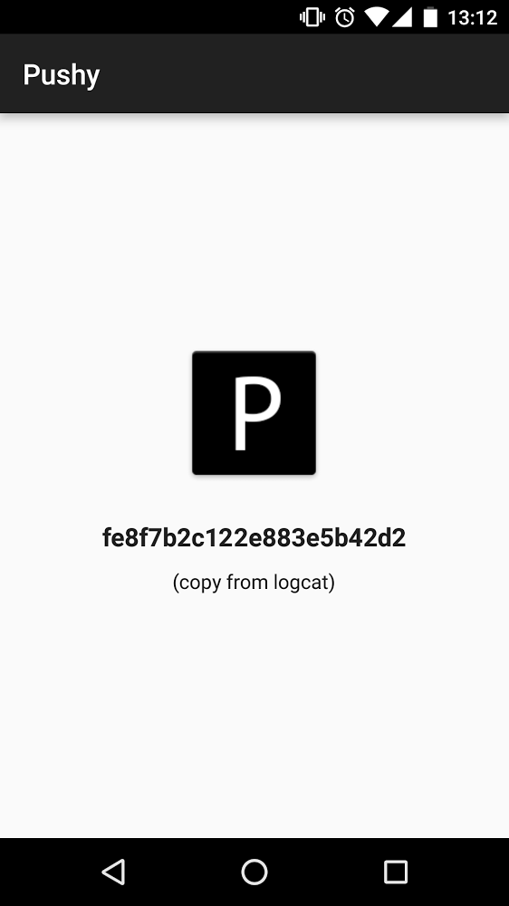
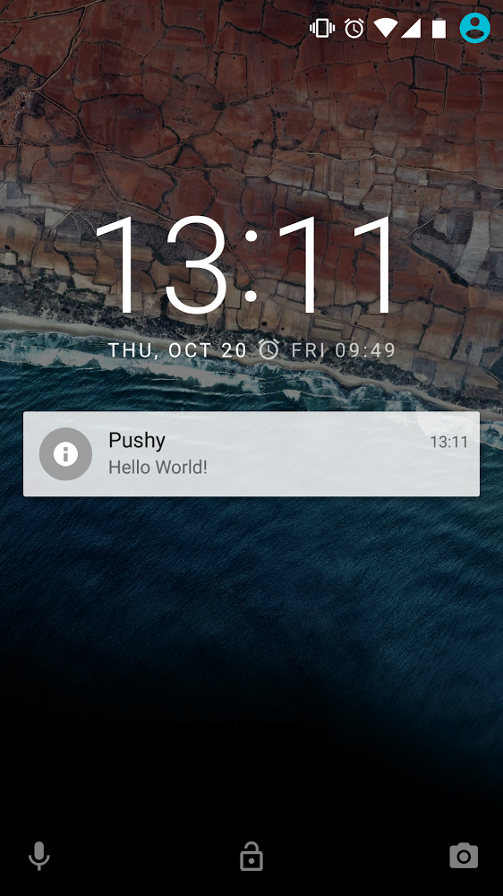

# pushy-demo-android

A demo of the [Pushy Android SDK](https://pushy.me/docs/android/get-sdk) integrated into a sample Android app.

> [Pushy](https://pushy.me/) is the most reliable push notification gateway, perfect for real-time, mission-critical applications.

This app registers your device to receive push notifications and assigns it a unique registration ID, which you can copy and paste into the [demo page](https://pushy.me/docs/resources/demo) to send yourself a test push notification.

## Links

* [Demo Page](https://pushy.me/docs/resources/demo)
* [Google Play Listing](https://play.google.com/store/apps/details?id=me.pushy.example)

## Screenshots

 

## Get Started

* Clone the repository locally
* Open `pushy-demo.iml` with Android Studio
* Build and run the demo application on either a physical device or emulator
* Copy the registration ID from the device logcat and paste it into the [demo page](https://pushy.me/docs/resources/demo) to send yourself a test notification

## More Information

* [Pushy](https://pushy.me/)
* [Pricing](https://pushy.me/pricing)
* [Documentation](https://pushy.me/docs)

## License

[Apache 2.0](LICENSE)
